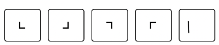
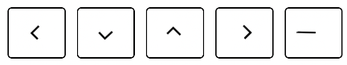

# Simple Universal Language

**Visit the website at https://simple-universal-language.vercel.app**

Simple Universal Language (SUL) is a verbal and written auxiliary language with the primary goal of being the easiest written and verbal language to learn.

## Goals of SUL

- Be the official primary auxiliary language of Earth.
- Facilitate international communication.
- Facilitate international understanding.
- Facilitate international cooperation.
- Facilitate international business.
- Facilitate international tourism.
- Facilitate international education.
- Facilitate international entertainment.
- Facilitate international science.
- Offer people a second language that takes weeks to learn instead of years.
- Remove international barriers created by time zones and daylight savings time (not using GMT is forbidden in SUL).
- Remove international barriers created by imperial measurement system (not using metric is forbidden in SUL).
- Remove international barriers created by 12 hour clock system (not using 24 hour clock is forbidden in SUL).
- Massively raise the bar for language accessability standards.

## Features of SUL

- Easy to learn. You can start talking in SUL in under an hour.
- Design of the language does not favour any specific culture or country. Everyone must learn the SUL characters.
- Create a single unified language that is accessible via speech, feel and vision.
- SUL incorporates a braille style system that can be placed directly over the visual written language (so for example restaurant menus would be the same for visual people, but the letters in them would be overlaid with bumps so visually impaired people could also read them, etc).
- SUL incorporates a sign language system that follows the exact grammar and syntax of the written language.
- No synonyms in the 'core' SUL dictionary. For example there is only 1 word that means 'good' instead of multiple words like 'good' and 'well'.
- No homonyms in the 'core' SUL dictionary. For example no misunderstandings caused by not knowing if someone means walking 'past' the car or something that happened in the 'past'.
- No two words are spelled or pronounced the same way.
- Very little punctuation.
- Properly supports references to people with non-binary genders.
- Virtually no, letter, grammar or syntax exceptions in the entire language.
- SUL letters are easy to see from a distance because the characters are mono spaced and visually unique.
- SUL letters collapse into simple symbols to reduce horizontal space and increase reading/comprehension speed (imagine in English if each letter was an entire syllable).
- SUL is a phonetic language. This means that the pronunciation of a word is very similar to the spelling of the word. This makes it easy to learn how to pronounce words.
- Pronounciation of SUL letters and words never changes, even depending on letter position.
- Extended dictionary of more than 80 thousand words is available for transcribing the meaning of artforms like poetry.
- SUL is versioned and refactored similar to programming languages. The language continues to improve and become even more useful over time.
- Vagueness in the SUL language is impossible. There are no words like 'it' or 'that', or even 'they'.
- No passive voice. Simplifies the language's rules and syntax greatly.
- It's extremely easy to automatically transcribe SUL into other languages while being certain that meaning of the words has not been altered. You could write subtitles for a movie once and have the meaning transcribed to every other language with high accuracy.
- Excellent for machine learning purposes due to the simplicity of the language and the consistency of it's rules.
- You only need to learn a fraction of the words as compared to other langauges.
- SUL is almost completely deterministic. When you hear or read SUL the meaning is difficult to mistake (not to the level of a true 'loglang', but much more so than most natural languages).
- SUL words only ever mean exactly one thing. No SUL word has multiple assigned meanings.
- No determination between things like nouns and verbs. Words are words.
- SOV word order.
- Virtually no punctuation at all on basic sentences, making the language very "quick".
- Complexity rating system on words and sentences to objectively measure the complexity of written work and encourage people to refactor their writing to relay thoughts as simply as possible. Imagine how much better wikipedia would be if there was actually a way to objectively measure the complexity of an article and encourage people to simplify complex articles by using more "basic" words.

## Characters/symbols

This is the full set of all SUL characters.

There are 5 vowels.

And 5 consonants.

Every two sequential letters can be easily collapsed into a corresponding symbol to reduce horizontal space.

Here is a picture of all SUL characters.

## IPA pronunciation

| **CONSONANTS** | Bilabial | Labio­dental-dental | Alveolar | Palatal | Velar |
| -------------- | -------- | ------------------- | -------- | ------- | ----- | --- | --- | --- | --- | --- |
| **Pulmonic**   |          |                     |          |         |       |     |     |     |     |     |
| Plosive        |          | b                   |          |         | t     |     |     |     | k   | g   |
| Nasal          |          | m                   |          |         |       |     |     |     |     |     |
| Fricative      |          |                     | f        |         | s     |     |     |     |     |     |
| Approximant    |          |                     |          |         |       |     |     | j   |     |     |
| **VOWELS**     | Front    | Back                |          |         |       |     |     |     |
| Close          | i        |                     |          | u       |       |     |     |     |     |     |
| Close-mid      | e        |                     |          | o       |       |     |     |     |     |     |
| Open           | a        |                     |          |         |       |     |     |     |     |     |
